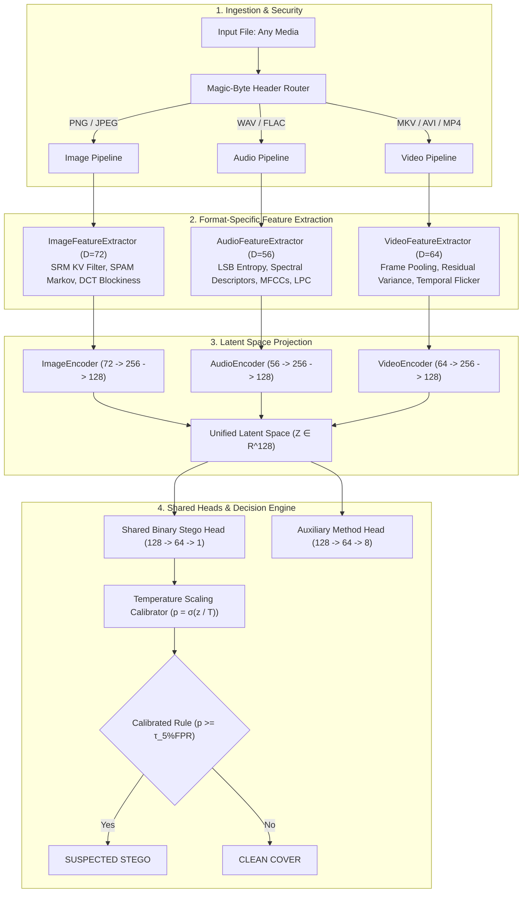

# 🛡️ VaultBreaker: Unified Multi-Modal Steganography Detection

[](tests/)
[](requirements.txt)
[](Makefile)
[](https://pytorch.org/)

**VaultBreaker** is a unified machine learning pipeline that detects hidden data (steganography) across **Images**, **Audio**, and **Video** files using format-specialized feature extractors and a shared classification framework.

---

## 🚀 Quickstart (One Command)

To run the entire end-to-end pipeline (dataset generation, feature extraction, training, calibration, and evaluation) in **under 3 minutes** on CPU:

```bash
make fast
```

*(On Windows Command Prompt: `run.bat fast`, or Windows PowerShell: `.\run.ps1 -Target fast`)*

To launch the forensic Web UI:
```bash
make app
# Or: streamlit run app/streamlit_app.py
```

To launch the REST API:
```bash
make api
# Interactive Swagger docs: http://localhost:8000/docs
```

---

## 📐 Architecture Overview



---

## 🔒 Rigor & Integrity Guarantees

1. **Re-Encoding Invariance**: Every cover file goes through the exact same decode $\to$ encode $\to$ write path as its stego counterpart (same codec, bit depth, format library) so the model cannot learn file format or compression artifacts as shortcuts.
2. **Disjoint Source Splitting**: All variants of a source media file (clean and stego) are strictly assigned to the same partition (Train: 70%, Val: 15%, Test: 15%). Zero cross-split contamination.
3. **Pure-Python Portability**: All embedding algorithms are implemented in pure Python and NumPy without external native C dependencies, running seamlessly on Windows, macOS, and Linux.

---

## 📦 Project Structure

```
vaultbreaker/
├── configs/default.yaml        # All hyperparameters, seeds, and paths
├── data/
│   ├── generated/              # Paired clean and stego media (images, audio, video)
│   ├── splits/                 # Disjoint CSV manifests (manifest_all.csv, manifest_train.csv)
│   └── features/               # Cached feature vectors (.npz)
├── src/vaultbreaker/
│   ├── data/                   # Procedural generators, downloaders, splitting, integrity tests
│   ├── embedders/              # Pure Python LSB, DCT, audio echo, and video embedders
│   ├── features/               # Image (72d), Audio (56d), Video (64d) extractors
│   ├── models/                 # Encoders, shared head, unified net, classical baselines
│   ├── training/               # Joint multi-modal trainer, dataset, temperature calibrator
│   ├── inference/              # Magic-byte router, predictor, reporting
│   ├── explain/                # SRM heatmaps, LSB bit planes, spectrograms, timelines
│   └── utils/                  # Seeding, logging, IO helpers
├── app/streamlit_app.py        # Dark cybersecurity forensic web console
├── api/main.py                 # FastAPI service with /scan and /health endpoints
├── scripts/                    # CLI scripts (make_dataset, extract_features, train, evaluate, predict)
├── demo_samples/               # Source-disjoint test set for viva demo (10 clean + 10 stego per format)
├── tests/                      # Pytest suite (27 unit and integration tests)
├── docs/
│   ├── ARCHITECTURE.md         # In-depth architectural & mathematical design
│   ├── REPORT.md               # Full academic-format evaluation report
│   └── RESULTS/                # Real ROC curves, confusion matrices, metrics.json
├── Makefile                    # Automation runner
├── requirements.txt            # Pinned dependencies
└── README.md
```

---

## 🛠️ Step-by-Step Workflow

### 1. Installation
```bash
pip install -r requirements.txt
pip install -e . --no-deps
```

### 2. Dataset Generation (~2 minutes)
```bash
# Full dataset (Real covers from Imagenette, ESC-50, and visual motion video):
python scripts/make_dataset.py

# Or fast demo dataset:
python scripts/make_dataset.py --fast
```

### 3. Feature Extraction (~2 minutes)
```bash
python scripts/extract_features.py --num-workers 4
```

### 4. Model Training & Calibration (~30 seconds)
```bash
python scripts/train.py
```

### 5. Comprehensive Evaluation & Reporting (~20 seconds)
```bash
python scripts/evaluate.py
python scripts/generate_report.py
```
Outputs ROC curves, confusion matrices, accuracy vs payload curves, and `metrics.json` directly into `docs/RESULTS/`, and regenerates `docs/REPORT.md`.

### 6. Single & Batch Inference CLI
```bash
# Single file scan from viva demo samples:
python scripts/predict.py demo_samples/image/img_src_0001_clean_01.png

# Batch folder scan with JSON output:
python scripts/predict.py demo_samples/image/ --json scan_results.json
```

---

## 🧪 Testing

Run the full pytest suite (round-trip tests, feature shapes, integrity rules, model passes, router security):
```bash
pytest tests/ -v
```

---

## 🔧 Troubleshooting

- **`No module named 'vaultbreaker'`**: Run `pip install -e . --no-deps` from the project root.
- **Port Conflict for Streamlit (8501)**: Run on another port: `streamlit run app/streamlit_app.py --server.port 8502`.
- **OpenMP Warning on macOS**: Handled automatically; baseline models use histogram gradient boosting to avoid multi-thread runtime collisions.

---

## ⚖️ Ethics & Defensive Use

VaultBreaker is built strictly for **defensive digital forensics, intellectual property protection, and academic research**. Embedding algorithms are included solely to produce benchmark training distributions in laboratory environments.
