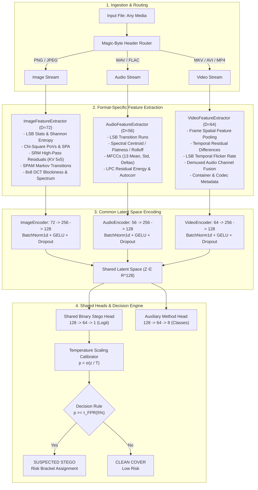

# VaultBreaker Architecture & Technical Specification

VaultBreaker is a unified, multi-modal machine learning pipeline engineered to detect hidden steganographic data across **Images**, **Audio**, and **Video** files using format-specific feature extraction coupled with a shared classification latent space.

---

## 1. Steganography Embedding Mathematics

Steganographic embedding introduces subtle modifications to carrier media to encode covert message bits $M = \{m_1, m_2, \dots, m_K\} \in \{0, 1\}^K$.

### 1.1 Spatial Image Steganography
- **LSB Replacement**: Replaces bit 0 of pixel $x_i$:
  $$x_i' = (x_i \land \sim 1) \lor m_k$$
  This creates asymmetric pairs of values (PoVs) between $2k$ and $2k+1$, producing detectable histogram artifacts.
- **LSB Matching ($\pm 1$ Embedding)**: If $x_i \pmod 2 \neq m_k$, randomly adds $+1$ or $-1$:
  $$x_i' = \begin{cases} x_i + 1 & \text{with prob } 0.5 \\ x_i - 1 & \text{with prob } 0.5 \end{cases}$$
  This avoids the PoV asymmetry while slightly increasing high-frequency spatial noise.
- **Edge-Adaptive Embedding**: Computes the gradient magnitude $G(x, y) = \sqrt{(\partial_x I)^2 + (\partial_y I)^2}$. Bits are embedded strictly in pixels with $G(x, y) > \theta$, hiding payloads within naturally noisy textures.
- **DCT-Domain Steganography**: Partitions the image into $8 \times 8$ blocks, computes 2D orthogonal DCT, quantizes with JPEG luminance matrix $Q$, and embeds in the LSB of mid-frequency AC coefficients before computing IDCT.

### 1.2 Audio Steganography
- **LSB Audio Replacement/Matching**: Modifies the least significant bit of 16-bit PCM integer samples $s[n] \in [-32768, 32767]$.
- **Echo Hiding**: Adds an inaudible delayed resonance:
  $$s'[n] = s[n] + \alpha \cdot s[n - d_m]$$
  where $d_0$ and $d_1$ represent bit 0 and bit 1 respectively, and $\alpha \approx 0.08$ is below the human psychoacoustic threshold.

### 1.3 Video Steganography
- **Lossless Frame Embedding**: Distributes payload bits across sampled video frames using lossless containers (FFV1 in MKV or uncompressed AVI). Lossy H.264/HEVC compression would quantize high-frequency coefficients and destroy single-bit payloads.
- **Audio-Track Embedding**: Integrates audio stego payloads into the multiplexed audio track of the container.

---

## 2. Format-Specific Feature Extraction

### 2.1 Image Features (72 Dimensions)
1. **LSB Plane Statistics (8)**: Mean bit density, variance, horizontal/vertical bit transition frequencies, 2D Shannon bit entropy, run-length moments, and 2nd-LSB bit correlation.
2. **Chi-Square & Sample Pair Analysis (6)**: Chi-square statistic over PoVs, log-transformed Chi-square, Sample Pair Analysis (SPA) estimate, diagonal variance, and parity autocorrelation.
3. **Pixel Histogram Moments (8)**: Mean, standard deviation, skewness, kurtosis, consecutive bin differences, zero-pixel ratio, and saturation ratio.
4. **Spatial Rich Models (SRM) & SPAM (36)**:
   - 1st-order horizontal and vertical differences: $[-1, 1]$
   - 2nd-order Laplacian kernel: $\begin{bmatrix} 0 & 1 & 0 \\ 1 & -4 & 1 \\ 0 & 1 & 0 \end{bmatrix}$
   - KV $5 \times 5$ filter kernel:
     $$K_{KV} = \frac{1}{12} \begin{bmatrix} -1 & 2 & -2 & 2 & -1 \\ 2 & -6 & 8 & -6 & 2 \\ -2 & 8 & -12 & 8 & -2 \\ 2 & -6 & 8 & -6 & 2 \\ -1 & 2 & -2 & 2 & -1 \end{bmatrix}$$
   - SPAM (Sub-model of Spatial Rich Models): Quantizes horizontal and vertical residuals with $T=3 \implies \{-3, \dots, +3\}$ and extracts Markov transition probabilities $P(r_{i+1} = u \mid r_i = v)$ (24 features).
5. **Blockiness & DCT Metrics (14)**: Horizontal and vertical 8x8 boundary blockiness indices, DC variance, AC mid-frequency energy fraction, high-frequency energy fraction, and quantization rounding artifacts.

### 2.2 Audio Features (56 Dimensions)
1. **LSB Dynamics & Chi-Square (8)**: 16-bit LSB stream entropy, run-length variance, sample amplitude pair Chi-Square.
2. **Time-Domain Moments (8)**: Mean, standard deviation, skewness, kurtosis, zero-crossing rate (ZCR mean & std), dynamic range.
3. **Spectral Descriptors (14)**: STFT spectral centroid, flatness, rolloff (85%), spectral bandwidth, high-frequency energy ratio ($f > f_s / 4$), noise-floor quantiles, and spectral flux.
4. **LPC Residuals & Autocorrelation (10)**: Order-8 Linear Predictive Coding inverse-filter residual variance, kurtosis, skewness, prediction error energy, and autocorrelation lag peaks.
5. **MFCC Analysis (16)**: 13 mel-frequency cepstral coefficients, standard deviation summary, delta MFCC, and delta-delta MFCC.

### 2.3 Video Features (64 Dimensions)
1. **Spatio-Temporal Aggregation (24)**: Uniform sampling of $K$ frames; computes core image steganographic indicators per frame and aggregates via mean, standard deviation (temporal flicker), maximum, and 90th-10th percentile range.
2. **Temporal Difference & Residual Dynamics (16)**: Mean absolute frame difference ($\Delta F$), variance, skewness, kurtosis; inter-frame noise residual correlation $Corr(R_t, R_{t+1})$; temporal LSB flicker rate $|LSB_{t+1} - LSB_t|$; 2nd-order temporal acceleration $\Delta^2 F$; and pixel trajectory entropy.
3. **Audio Channel Fusion (16)**: Demuxed audio channel feature vector extraction (LSB stats, LPC variance, spectral centroid, MFCC summary).
4. **Container & Stream Metadata (8)**: Frame rate (fps), total frame count, duration, aspect ratio, byte density per pixel, and lossless container flags.

---

## 3. Unified Multi-Modal Neural Network

### 3.1 Per-Format Encoders
Each media format $m \in \{\text{image}, \text{audio}, \text{video}\}$ passes through a dedicated MLP encoder:
$$\mathbf{z} = E_m(\mathbf{x}_m) = \text{Dropout}(\text{BatchNorm}(\text{GELU}(\mathbf{W}_2 \cdot \text{Dropout}(\text{BatchNorm}(\text{GELU}(\mathbf{W}_1 \mathbf{x}_m + \mathbf{b}_1))) + \mathbf{b}_2)))$$
where $\mathbf{z} \in \mathbb{R}^{128}$ is the unified latent representation.

### 3.2 Shared Classification & Auxiliary Heads
1. **Binary Stego Head**:
   $$\hat{y}_{\text{logit}} = \mathbf{w}_h^T \text{GELU}(\mathbf{W}_h \mathbf{z} + \mathbf{b}_h) + b_0$$
2. **Auxiliary Method Head**:
   $$\hat{\mathbf{y}}_{\text{method}} = \mathbf{W}_{\text{aux}} \text{GELU}(\mathbf{W}_{\text{aux1}} \mathbf{z} + \mathbf{b}_{\text{aux1}}) + \mathbf{b}_{\text{aux}}$$
   Providing multi-task regularization during latent space alignment.

### 3.3 Loss Function
$$\mathcal{L} = \mathcal{L}_{\text{BCE}}(\hat{y}, y) + \lambda_{\text{aux}} \mathcal{L}_{\text{CE}}(\hat{\mathbf{y}}_{\text{method}}, \mathbf{y}_{\text{method}})$$
where $\lambda_{\text{aux}} = 0.3$.

---

## 4. Probability Calibration & Decision Thresholding

Uncalibrated neural networks typically produce overconfident probabilities. VaultBreaker employs **Temperature Scaling**:
$$p_{\text{cal}} = \sigma\left(\frac{\hat{y}_{\text{logit}}}{T}\right)$$
The optimal temperature $T > 0$ is learned on the validation partition via negative log-likelihood minimization:
$$T^* = \arg\min_T -\sum_{i=1}^{N_{\text{val}}} \left[ y_i \log \sigma\left(\frac{z_i}{T}\right) + (1 - y_i) \log \left(1 - \sigma\left(\frac{z_i}{T}\right)\right) \right]$$

### Target-FPR Threshold Selection
In forensic applications, false accusations must be strictly bounded. The decision threshold $\tau$ is chosen to satisfy a target False Positive Rate (e.g., $\text{FPR} \le 5\%$):
$$\tau = \text{Quantile}_{1 - \alpha}\left(\{p_{\text{cal}}(x) \mid x \in \text{Covers}_{\text{val}}\}\right)$$
resulting in calibrated risk brackets:
- $p < 0.20$: **BENIGN / CLEAN**
- $0.20 \le p < 0.40$: **LOW RISK**
- $0.40 \le p < 0.65$: **MEDIUM RISK**
- $0.65 \le p < 0.85$: **HIGH RISK**
- $p \ge 0.85$: **CRITICAL RISK**
