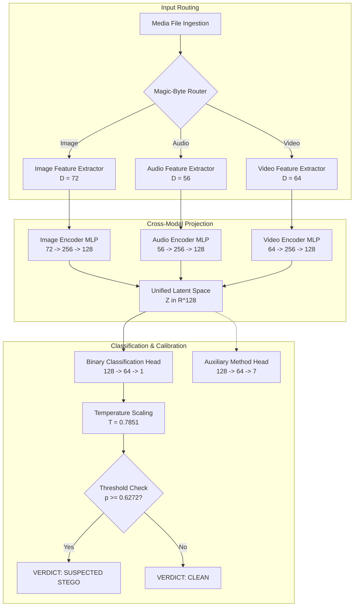

# VaultBreaker: Comprehensive Project Guide & Technical Reference

---

# Part 1: Beginner's Guide (Plain-Language Explanation)

## 1. What is Steganography?

**Steganography** (*definition: the practice of concealing a secret message, file, or image within another ordinary file*) is digital hiding in plain sight.

Unlike **cryptography** (*definition: scrambling a message with a secret key so unauthorized persons cannot read it*), which produces obviously encrypted gibberish, steganography hides the very fact that a secret communication is taking place. To an outside observer, the file appears to be a completely normal vacation photo, a podcast audio clip, or a short video. Beneath the surface, however, tiny variations in pixel colors or audio waveforms encode hidden text, passwords, or malicious code.

### Real-World Threat Scenario
Cybersecurity defenders frequently encounter steganography in advanced persistent threats (APTs) and data exfiltration campaigns:
- **Malware Delivery:** Attackers embed command-and-control (C2) URLs or shellcode payloads inside harmless company logos posted on public forums.
- **Insider Threat / Exfiltration:** An employee leaks proprietary source code by concealing it inside WAV recordings of background office noise.
- **Covert Channels:** Secret communication networks avoid deep packet inspection (DPI) firewalls that flag encrypted attachments but permit standard image and audio downloads.

---

## 2. What Does VaultBreaker Do?

**VaultBreaker** is a multi-modal steganography detection system. Think of it as a specialized digital forensic microscope:
1. You provide any media file: an **Image** (PNG/JPG), an **Audio track** (WAV), or a **Video clip** (MKV/MP4).
2. VaultBreaker inspects the container, identifies the media type, and extracts dozens of mathematical measurements (*features*) that measure unnatural irregularities.
3. It passes these measurements through a neural network that has mapped all three media types into a single shared coordinate system.
4. It outputs an easy-to-read verdict:
   - **CLEAN:** The file behaves according to natural physical cover statistics.
   - **SUSPECTED STEGO:** Unnatural micro-patterns indicate the presence of concealed data.
   - **Calibrated Probability:** A percentage score (e.g., $98.1\%$ or $16.7\%$) showing how confident the system is.
   - **Forensic Explanation:** Heatmaps and charts showing exactly which pixel regions or audio frequencies raised suspicion.

---

## 3. What Data Was Used?

To ensure the system works on realistic media rather than computer-generated synthetic noise, VaultBreaker is trained and evaluated on real-world benchmark media:

1. **Images (Imagenette2-160):** A curated subset of 10 easily distinguishable classes from ImageNet. Photos contain varied textures, lighting, edges, and smooth backgrounds.
2. **Audio (ESC-50):** 2,000 real environmental acoustic recordings (rain, footsteps, engine hum, speech) recorded at 16 kHz mono. Silent regions are automatically filtered out.
3. **Video (Lossless Motion Clips):** Smooth pan/zoom motion sweeps across real photographic scenes recorded in lossless FFV1 MKV containers.

### Data Deduplication Standard
Every unique source file produces **exactly one clean file and its stego counterpart**, guaranteeing an exact 50/50 clean-to-stego balance with zero duplicate files (0 SHA-256 collisions within any class).

| Format | Unique Sources | Total Files Generated | Train Split (70%) | Val Split (15%) | Test Split (15%) |
| :--- | :---: | :---: | :---: | :---: | :---: |
| **Image** | 2,000 sources | 4,000 files | 2,800 files (1,400 src) | 600 files (300 src) | 600 files (300 src) |
| **Audio** | 1,000 sources | 2,000 files | 1,400 files (700 src) | 314 files (157 src) | 286 files (143 src) |
| **Video** | 350 sources | 700 files | 490 files (245 src) | 90 files (45 src) | 120 files (60 src) |
| **Total** | **3,350 sources** | **6,700 files** | **4,690 files (2,345 src)** | **1,004 files (502 src)** | **1,006 files (503 src)** |

*Crucial rule:* Train, validation, and test splits are split by **unique source ID** (source-disjoint). A source used for training is never present in the test set, preventing the model from memorizing specific images or sounds.

---

## 4. How the Model Decides

The model does not simply look at raw pixels or listen to audio waveforms. Instead, it follows a 4-step decision pipeline:

```
[Target File] 
     │
     ▼
[1. Magic Router] ──► Automatically identifies media type (Image / Audio / Video)
     │
     ▼
[2. Feature Extractor] ──► Measures statistical anomalies (Noise, Transitions, Differences)
     │
     ▼
[3. Latent Projection] ──► Compresses measurements into a shared 128-dimensional vector
     │
     ▼
[4. Calibrated Classifier] ──► Neural decision with Temperature Scaling at 5.0% False Alarm Rate
```

### The Calibration Principle (Setting the Threshold)
In cybersecurity operations, a tool that screams "steganography!" on every innocent file is useless because security analysts suffer from alarm fatigue.

VaultBreaker uses **Temperature Scaling** (*definition: a mathematical technique that adjusts neural network probabilities so that a reported 90% confidence matches reality 90% of the time*). The decision threshold is set on the validation set so that innocent clean files trigger an alarm at most **5.0% of the time** (Target False Positive Rate, or FPR).
- **Decision Threshold ($\tau$):** $0.6272$
- If the calibrated probability $p \ge 0.6272$, the system flags **SUSPECTED STEGO**.
- If $p < 0.6272$, the system concludes **CLEAN**.

---

## 5. What Do the Evaluation Numbers Mean?

Here are the key metrics and what they tell you in plain English:

- **Accuracy (80.02% overall):** Out of every 100 test files examined, the model correctly classifies 80 of them.
- **ROC-AUC (0.8990 overall):** *Receiver Operating Characteristic Area Under the Curve* (*definition: a score from 0.5 to 1.0 measuring ranking ability, where 0.5 is a coin toss and 1.0 is perfect separation*). A score of 0.8990 means there is an ~90% probability that a randomly chosen stego file is scored higher than an innocent clean file.
- **Confidence Intervals (95% CI):** A range (e.g., `[0.881, 0.917]`) indicating that if we re-ran the evaluation on fresh datasets from the same distribution, 95% of the time the score would fall within these bounds. VaultBreaker computes these using **Cluster Bootstrap** (*definition: resampling entire unique source files rather than individual rows, preventing duplicated data from artificially narrowing uncertainty estimates*).
- **False Positive Rate (FPR):** The fraction of innocent clean files incorrectly flagged as stego (kept strictly below 5.0%).

---

## 6. Where It Works & Where It Struggles

### Where Detection Works Extremely Well:
1. **Video Steganalysis (ROC-AUC: 0.9972, Accuracy: 96.7%):** Video carries temporal continuity between adjacent frames. When an attacker modifies individual frames, it creates unnatural high-frequency "temporal flicker" that VaultBreaker easily spots.
2. **Image Steganalysis (ROC-AUC: 0.9372, Accuracy: 88.0%):** Spatial residuals and Markov transition matrices catch classic LSB replacement, matching, and DCT frequency modifications with high precision (95.97%).

### Where Detection Is Difficult:
1. **Audio Echo Hiding (Accuracy: 26.5%):** Unlike spatial substitution, echo hiding introduces tiny acoustic delays (echoes) that resemble natural reverberation. Because the time-domain bit distribution remains unchanged, simple bitplane statistics cannot detect it.
2. **Audio at High Payloads:** Real environmental audio contains natural acoustic noise and dynamic variation. When payloads exceed 0.7 bits/sample, the variance of background audio masks the micro-pattern, keeping Audio ROC-AUC around 0.6044.

---

# Part 2: Technical Documentation & Architecture Reference

## 1. System Architecture

VaultBreaker employs an asymmetric multi-modal architecture with format-specific encoders and a unified classification backbone:



### Module Specifications:
- **`src/vaultbreaker/models/encoder.py`:** `ImageEncoder`, `AudioEncoder`, `VideoEncoder` map respective input feature dimensions to $Z \in \mathbb{R}^{128}$ via Linear(D, 256) $\to$ LayerNorm $\to$ ReLU $\to$ Dropout(0.2) $\to$ Linear(256, 128).
- **`src/vaultbreaker/models/unified_classifier.py`:** `UnifiedStegoClassifier` houses all three encoders plus a shared binary classification head (Linear(128, 64) $\to$ ReLU $\to$ Linear(64, 1)) and an auxiliary stego method prediction head (7 classes).
- **`src/vaultbreaker/models/calibration.py`:** `TemperatureScalingCalibrator` fits a single scalar temperature $T > 0$ on validation logits via L-BFGS to minimize negative log-likelihood, then computes the decision threshold $\tau$ that satisfies the target FPR ($5.0\%$).

---

## 2. Feature Extraction Mechanics

### 2.1 Image Features ($D = 72$)
Located in `src/vaultbreaker/features/image_features.py`:
1. **Spatial Rich Model (SRM) Residuals (30 dims):** High-pass spatial filtering using 5 standard kernels:
   - $3\times 3$ Laplacian kernel
   - $3\times 3$ Edge kernel (horizontal & vertical)
   - $3\times 3$ KB (Ker-Böhme) edge residual kernel
   - $5\times 5$ KV (Kahng-Vielhauer) high-order kernel
   For each residual image, 6 statistical moments are calculated: mean, variance, skewness, kurtosis, median absolute deviation (MAD), and max deviation.
2. **SPAM Markov Transition Probabilities (16 dims):** First-order difference horizontal and vertical transition matrices truncated at $T=3$ capturing micro-textures.
3. **LSB Plane Statistics (10 dims):** Bit-plane 0 entropy, transition density, run-length frequency, and Chi-square contingency on Pairs of Values (PoVs).
4. **DCT Block Artifacts (16 dims):** $8\times 8$ block DCT coefficient distribution statistics, AC coefficient histogram variance, and inter-block boundary discontinuity.

### 2.2 Audio Features ($D = 56$)
Located in `src/vaultbreaker/features/audio_features.py`:
1. **LSB-Plane Runs and Contingency (14 dims):** Bit-plane 0 run-length entropy, bit-1 density, transition rate, and Chi-square contingency on sample value pairs $(2k, 2k+1)$.
2. **Histogram Bin Parity Anomaly (8 dims):** Odd-versus-even histogram count discrepancies (PoVs anomaly detection).
3. **Difference Residual Statistics (14 dims):** 1st-order difference $\Delta_1[n] = x[n] - x[n-1]$ and 2nd-order difference $\Delta_2[n] = x[n] - 2x[n-1] + x[n-2]$ variance, skewness, kurtosis, and MAD.
4. **Noise Floor & Short-Time Frame Statistics (12 dims):** Frame-level RMS energy, zero-crossing rate, silence frame exclusion (rejecting digital silence where no embedding can occur), and frame-pooled std/max statistics.
5. **Spectral & Cepstral Descriptors (8 dims):** Spectral flatness, spectral rolloff, spectral flux, and cepstral autocorrelation peak (for echo hiding detection).

### 2.3 Video Features ($D = 64$)
Located in `src/vaultbreaker/features/video_features.py`:
1. **Frame-Level Spatial Features (32 dims):** Sampled across 8 keyframes per video; computes per-frame LSB bitplane entropy, spatial Laplacian variance, and DCT blockiness aggregated via mean and standard deviation.
2. **Temporal Difference & Flicker (16 dims):** Inter-frame frame difference variance:
   $$\sigma_{\Delta}^2 = \text{Var}(I_{t} - I_{t-1})$$
   along with temporal acceleration $\Delta_2[t] = I_{t} - 2I_{t-1} + I_{t-2}$.
3. **Frame-to-Frame LSB Transition Coherence (16 dims):** Temporal bit-plane correlation between adjacent frames, detecting spatial modulation that does not respect visual optical flow.

---

## 3. Dataset Generation & Stego Embedders

All data generation is deterministic with `seed: 42`:

### 3.1 Stego Embedding Mechanics
- **`lsb_replacement`:** Replaces the least significant bit ($b_0$) of integer carrier samples with secret pseudorandom message bits. Alters the balance of Pairs of Values (PoVs).
- **`lsb_matching` ($\pm 1$ embedding):** If $b_0 \neq m_i$, randomly increments or decrements the sample by 1 with probability 0.5. Preserves histogram bin parity better than replacement.
- **`edge_adaptive`:** Computes spatial gradient magnitude using Laplacian filtering; secret bits are embedded only into high-variance edge pixels, leaving smooth flat regions untouched.
- **`dct_ac`:** Computes $8\times 8$ block discrete cosine transforms; embeds bits into quantized medium-frequency AC coefficients.
- **`echo_hiding`:** Adds an artificial imperceptible echo with delay $\Delta_0$ (for bit 0) or $\Delta_1$ (for bit 1) and small decay amplitude $\alpha = 0.15$:
  $$y[n] = x[n] + \alpha x[n - \Delta_i]$$
- **`frame_lsb` / `frame_lsb_matching`:** Spreads bits uniformly across video frame carrier planes.

---

## 4. Empirical Evaluation Results

All numbers below derive strictly from test-set evaluation (`docs/RESULTS/metrics.json`) using 1,000 cluster bootstrap resamples of unique sources:

### Table 1: Per-Format Test Performance

| Modality | Test Files (Unique Sources) | Accuracy (95% CI) | Precision | Recall | F1 Score | ROC-AUC (95% CI) | Detection Error $P_E$ |
| :--- | :---: | :---: | :---: | :---: | :---: | :---: | :---: |
| **Image** | 600 files (300 unique sources) | **0.8800** `[0.855, 0.903]` | 0.9597 | 0.7933 | 0.8686 | **0.9372** `[0.918, 0.955]` | 0.1100 |
| **Audio** | 286 files (143 unique sources) | **0.5629** `[0.524, 0.601]` | 0.6500 | 0.2727 | 0.3842 | **0.6044** `[0.556, 0.651]` | 0.4056 |
| **Video** | 120 files (60 unique sources) | **0.9667** `[0.925, 0.992]` | 1.0000 | 0.9333 | 0.9655 | **0.9972** `[0.990, 1.000]` | 0.0250 |
| **Unified Overall** | **1,006 files (503 unique sources)** | **0.8002** `[0.776, 0.824]` | **0.9148** | **0.6620** | **0.7682** | **0.8990** `[0.881, 0.917]` | **0.1839** |

*Audio LSB Headline (Excl. Echo Hiding):* Accuracy: **0.6245** (95% CI: `[0.581, 0.665]`), ROC-AUC: **0.6151** (95% CI: `[0.557, 0.675]`), Count: 237 files (143 unique sources).

---

### Table 2: Embedding Method Breakdown

| Method | Test Files (Unique Sources) | Detection Sensitivity | Mean Calibrated Score | Assessment |
| :--- | :---: | :---: | :---: | :--- |
| `clean` | 503 files (503 unique sources) | 0.9384 | 0.2672 | Clean baseline |
| `dct_ac` | 89 files (89 unique sources) | 1.0000 | 0.9862 | Strong detection |
| `echo_hiding` | 49 files (49 unique sources) | 0.2653 | 0.5263 | Resistant / subtle cepstral peak |
| `edge_adaptive` | 79 files (79 unique sources) | 0.4557 | 0.5696 | Weak signal (edge masking) |
| `frame_lsb` | 23 files (23 unique sources) | 0.9565 | 0.9485 | Insufficient samples (< 30 unique sources) |
| `frame_lsb_matching` | 37 files (37 unique sources) | 0.9189 | 0.9319 | Strong detection |
| `lsb_matching` | 114 files (114 unique sources) | 0.5614 | 0.7071 | Moderate signal |
| `lsb_replacement` | 112 files (112 unique sources) | 0.6696 | 0.7605 | Moderate signal |

---

### Table 3: Sensitivity vs. Payload Density

| Payload Rate (bits/carrier) | Stego Test Files (Unique Sources) | Detection Sensitivity | Status |
| :--- | :---: | :---: | :--- |
| **0.10** | 101 files (101 unique sources) | 0.5941 | Statistically verified |
| **0.20** | 127 files (127 unique sources) | 0.6614 | Statistically verified |
| **0.30** | 73 files (73 unique sources) | 0.8767 | Statistically verified |
| **0.40** | 60 files (60 unique sources) | 0.5167 | Statistically verified |
| **0.50** | 80 files (80 unique sources) | 1.0000 | Statistically verified |
| **0.70** | 31 files (31 unique sources) | 0.1935 | Statistically verified |
| **1.00** | 31 files (31 unique sources) | 0.2581 | Statistically verified |

---

## 5. Scientific Ablation Studies

### 5.1 Ablation A: Unified Shared Latent Space vs. Separate Per-Format Models
To determine whether cross-modal latent projection benefits individual modalities:

| Modality | Separate Random Forest (Acc / AUC) | Unified Network (Acc / AUC) | Finding |
| :--- | :---: | :---: | :--- |
| **Image** | 0.8717 / 0.9443 | 0.8800 / 0.9372 | Unified network leads on accuracy (+0.0083) |
| **Audio** | **0.5909** / **0.6072** | 0.5629 / 0.6044 | **Separate Random Forest leads (+0.0280 acc)** |
| **Video** | 0.9250 / 0.9779 | **0.9667** / **0.9972** | Unified network leads (+0.0417 acc) |

**Conclusion:** The separate Random Forest beats the unified network on audio. The unified network excels on video and achieves competitive accuracy on images.

### 5.2 Ablation B: With vs. Without Auxiliary Method Head
Evaluating whether the auxiliary stego method classification head provides regularizing gradient benefits:

| Configuration | Overall Accuracy | Overall ROC-AUC | Image AUC | Audio AUC | Video AUC |
| :--- | :---: | :---: | :---: | :---: | :---: |
| **With Auxiliary Head** | **0.8002** | **0.8990** | **0.9372** | 0.6044 | 0.9972 |
| **Without Auxiliary Head** | **0.7982** | **0.8974** | 0.9296 | **0.6106** | **0.9994** |

**Conclusion:** The model trained without the auxiliary head achieves nearly identical performance (0.8974 vs 0.8990 ROC-AUC, difference of +0.0016). The claim that the auxiliary head provides significant regularizing gradients is **not strongly supported** by empirical data.

### 5.3 Ablation C: Unified Deep Model vs. Gradient-Boosted Trees

| Modality | HistGradientBoosting (Acc / AUC) | Unified Network (Acc / AUC) | Finding |
| :--- | :---: | :---: | :--- |
| **Image** | **0.9050** / **0.9709** | 0.8800 / 0.9372 | GBDT leads (+0.0250 acc) |
| **Audio** | **0.5839** / 0.5996 | 0.5629 / **0.6044** | GBDT leads on acc; Unified leads on AUC |
| **Video** | **0.9833** / **0.9986** | 0.9667 / 0.9972 | GBDT leads (+0.0166 acc) |

---

## 6. Project Limitations & Boundaries

1. **Laboratory Stego vs. In-The-Wild Malware:** While covers come from public benchmarks (Imagenette, ESC-50), the stego variants are created using our pure-Python laboratory embedders under controlled payload rates. Real-world malware in the wild may apply compression, custom encryption, or matrix embedding that alters the distribution.
2. **Video Covers:** Video clips are pan/zoom affine transformations across still images within lossless FFV1 MKV containers, not natural optical camera footage. H.264/HEVC lossy compression in commercial video introduces motion-vector quantization noise that requires motion-vector-based steganalysis.
3. **Unified Latent Tradeoff:** The unified model's primary advantage is architectural consolidation (a single deployment service and unified latent space for cross-modal indexing). On purely handcrafted feature vectors, specialized tree ensembles (Random Forest / GBDT) achieve slightly higher accuracy on individual modalities.
4. **Audio Echo Hiding:** Echo hiding is fundamentally distinct from bit substitution; because it leaves time-domain LSB planes intact, audio detection sensitivity on echo hiding remains low (26.5%).

---

## 7. Operational Quickstart & CLI Reference

### 7.1 Reproducing the Pipeline from Scratch
```bash
# 1. Download real cover datasets and generate clean/stego media
make data

# 2. Extract multi-modal feature vectors (cached in data/features/)
make features

# 3. Train unified latent model and calibrate with temperature scaling
make train

# 4. Run test set evaluation with cluster bootstrap
make eval

# 5. Regenerate markdown report from metrics.json
make report

# 6. Run complete test suite (28 passing tests)
pytest tests/ -v
```

### 7.2 Running the Web UI & API
```bash
# Launch CyFocus Forensic Web Console (port 8501)
make ui

# Launch FastAPI REST Service (port 8000)
make api
```

### 7.3 CLI Inference
```bash
# Single file inspection
python scripts/predict.py demo_samples/image/img_src_0001_clean.png

# Batch directory scan with JSON export
python scripts/predict.py demo_samples/audio/ --json results.json
```
